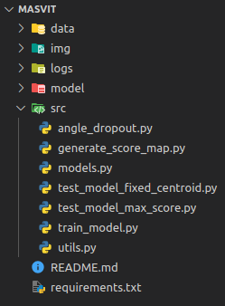
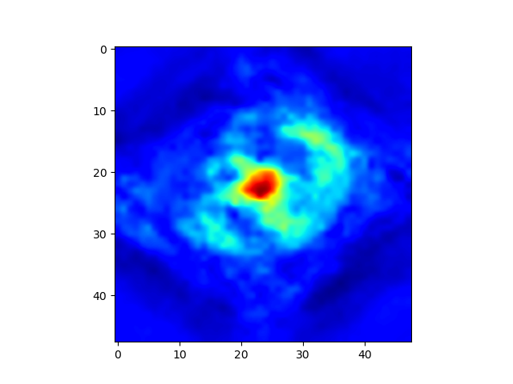

# MASViT
Official implementation of Multi-Angle-Scale Vision Transformer (MASViT) published in Neural Computing and Applications 2025. 

## Contents

 


- **data**: Suggested folder to save the datasets.
- **img**: This folder contains the accuracy and loss plot figures of training and other images.
- **logs**: This folder contains the logs of experiments for training and tests.
- **model**: This folder contains the file with the trained model weights.
- **src**: This folder contains the source code.
    - ***angle_dropout.py***: This script contains the implementation of Angle Dropout Layer class.
    - ***generate_score_map.py***: This executable script generates and saves a score map.
    - ***models.py***: This script contains the implementation of MASViT.
    - ***test_model_fixed_centroid.py***: This executable script tests MASViT using the Fixed Centroid approach.
    - ***test_model_max_score.py***: This executable script tests MASViT using the Max Score approach.
    - ***train_model.py***: This executable script trains the MASViT model.
    - ***utils.py***: This script contains the implementation of some auxiliar functions.
- ***LICENSE***: This file contains the license to use this project. 
- ***README.md***: This file contains the description and usage instructions for this project.
- ***requirements.txt***: This file contains a list of dependencies needed to work this project.


## Instalation

Install packages using pip with ***requirements.txt*** file.

```sh
	pip install -r requirements.txt
```

## Usage
Below is demonstrated how to train and to test MASViT, as well as how to generate and visualize the score maps.

**NOTE**: To correctly execute the following training and testing examples, ensure that you have downloaded the necessary datasets and saved them in the **data** folder.

### Training
For training, uses the ***train_model.py***. This executable script trains the MASViT model using GTSRB Train samples and validates with GTSRB Test samples.

Example of usage:
```sh
	python train_model.py 
```

### Tests
There are two test approaches to uses with MASViT: Fixed Centroid and Max Score. 

#### Fixed Centroid
To use this approach, uses the ***test_model_fixed_centroid.py***. This executable script tests MASViT using the Fixed Centroid approach, accepting the following parameters as arguments: the path to the pretrained model weights file (-m, --model), the test dataset (-d, --dataset), and the log file path (-l, --log), which contains the classification report of the test.

Example of usage:
```sh
	python test_model_fixed_centroid.py -m ../model/trained_model -d ../data/aff-GTSRB/el60 -l test_fixed_centroid_aff-GTSRB-el60.log 
```

#### Max Score
To use this approach, uses the ***test_model_max_score.py***. This executable script tests MASViT using the Max Score approach, accepting the following parameters as arguments: the path to the pretrained model weights file (-m, --model), the test dataset (-d, --dataset), and the log 
file path (-l, --log), which contains the classification report of the test.

Example of usage:
```sh 
	python test_model_max_score.py -m ../model/trained_model -d ../data/proj-GTSRB/el45 -l test_fixed_centroid_proj-GTSRB-el45.log  
```

### Generate Score Map
To generate score maps, uses the ***generate_score_map.py***. This executable script generates and saves a score map, accepting the following parameters as arguments: an input image path (-img, --image), 
a class index (-idx, --class_idx) and the path to the pretrained model weights file (-m, --model).

Example of usage:
```sh 
	python generate_score_map.py -m ../model/trained_model -img ../data/aff-GTSRB_el45_az45_01279.png -idx 0
```
After executing the script, the input image plot and a score map (corresponding to the chosen class index) are saved as shown below:

  

## Datasets
We utilized the GTSRB for training and validation. To evaluate MASViT’s robustness
for recognizing affine and projective deformations across different severity levels, we introduced
aff-GTSRB and proj-GTSRB datasets groups, each representing distinct deformation categories.
All dataset samples used have dimensions of 48x48.

**Note**: The datasets used in this project are not included in this code repository. The links to these dataset repositories will be available soon.

## License
This project is licensed under the MIT License - see the ***LICENSE*** file for details.

## Reference
If you find MASViT useful, please cite the following paper:

Luiz G. Charamba, Nivan Ferreira, Silvio Melo, **Providing Projective and Affine Invariance for Recognition by Multi-Angle-Scale Vision Transformer**, 
*Neural Computing & Applications*, Springer Nature, 2025 (Status: Accepted).

